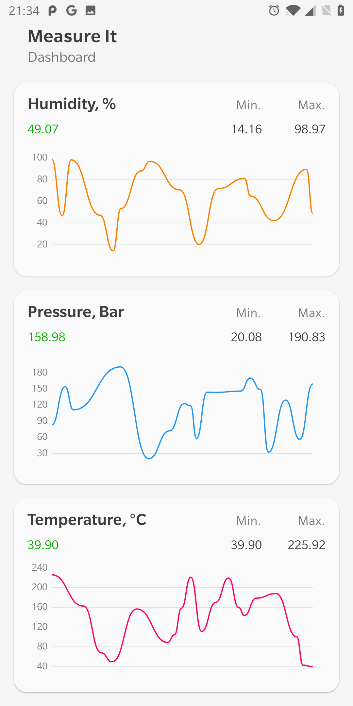

# Measure It

Rx-powered analytics dashboard example.

### Features

1. Rx-based data source and repository layers
2. Data sources with random data generation for:
    - humidity (%)
    - pressure (Bar)
    - temperature (C)
3. MVVM architecture
4. Material design
5. `MPAndroidChart` integration

### User Interface

    

